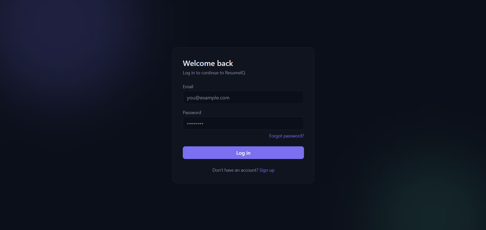
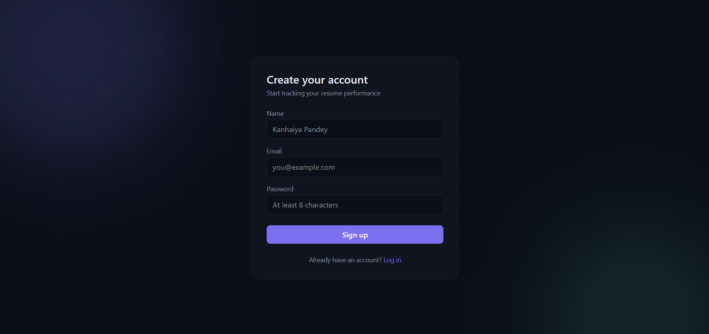
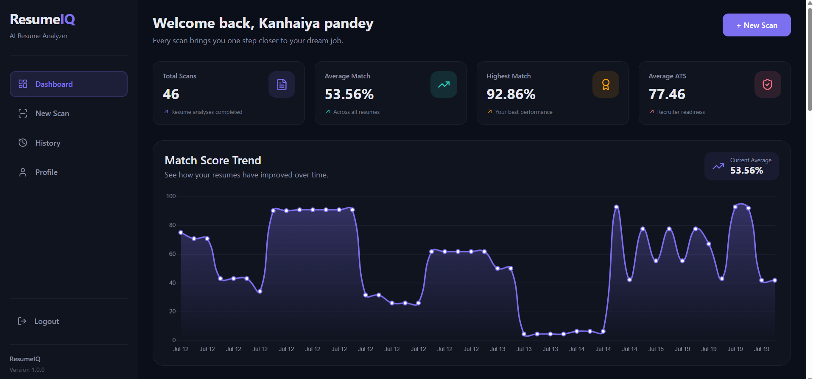
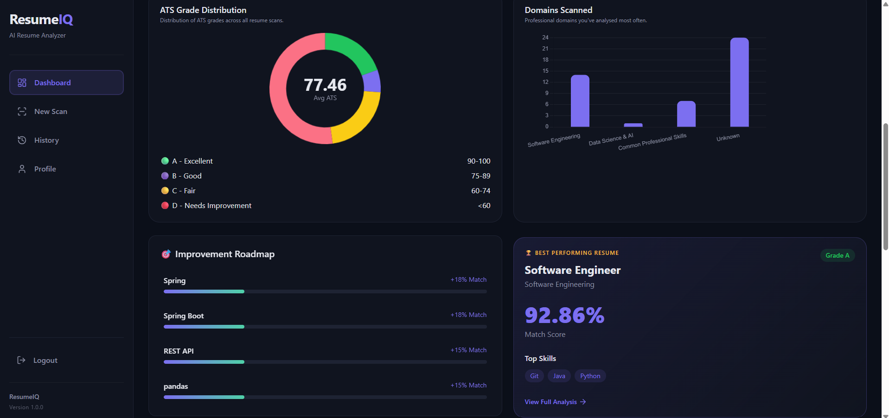
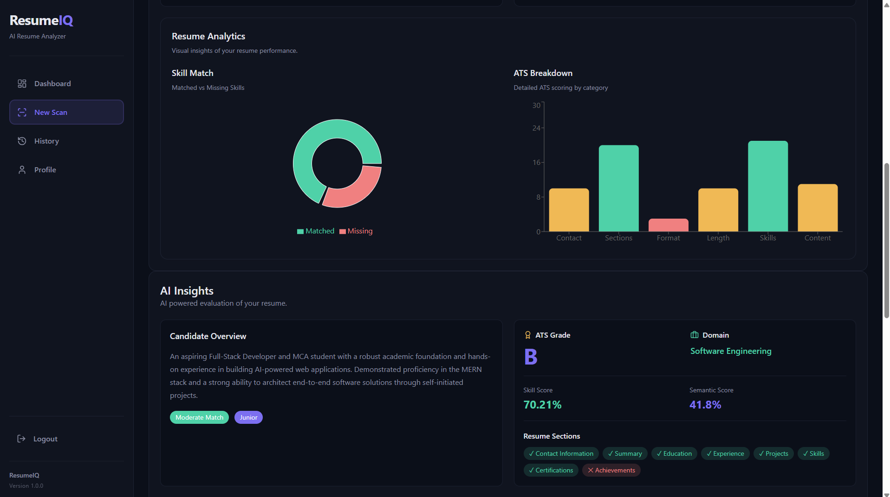
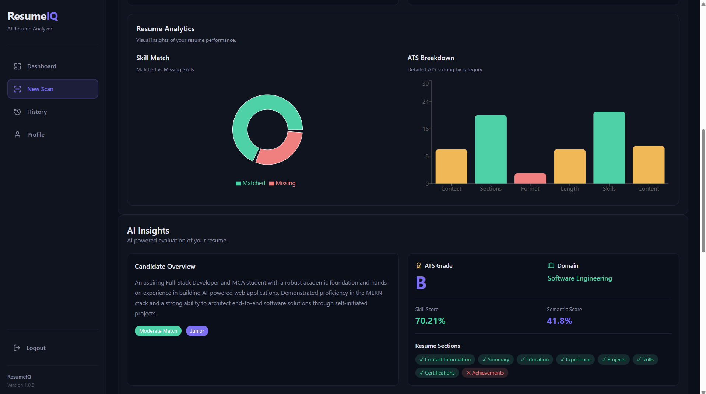
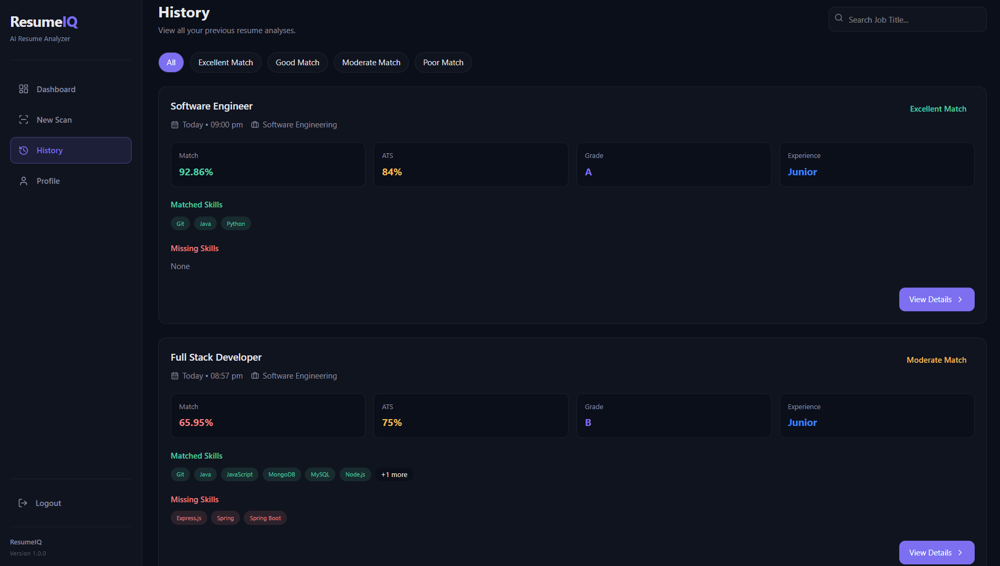

<div align="center">

# 🚀 ResumeIQ

### AI-Powered Resume Analyzer & ATS Optimization Platform

Analyze resumes, evaluate ATS compatibility, identify skill gaps, generate AI-powered recommendations, and create personalized cover letters using Google Gemini AI.

---


</div>

---

# 📖 Table of Contents

- [Overview](#-overview)
- [Problem Statement](#-problem-statement)
- [Solution](#-solution)
- [Key Features](#-key-features)
- [Technology Stack](#-technology-stack)
- [System Architecture](#-system-architecture)
- [Application Workflow](#-application-workflow)
- [Screenshots](#-screenshots)
- [Project Structure](#-project-structure)
- [Installation Guide](#-installation-guide)
- [Environment Variables](#-environment-variables)
- [Running the Project](#-running-the-project)
- [REST API Overview](#-rest-api-overview)
- [Future Enhancements](#-future-enhancements)
- [Author](#-author)

---

# 📌 Overview

ResumeIQ is a modern AI-powered Resume Analysis platform designed to help students and professionals improve their resumes before applying for jobs.

Instead of simply comparing keywords, ResumeIQ combines traditional ATS evaluation with Artificial Intelligence to provide meaningful insights about resume quality, missing skills, ATS compatibility, resume sections, semantic similarity, and personalized improvement recommendations.

The application analyzes uploaded resumes against any job description and produces a detailed report including:

- ATS Compatibility Score
- Skill Match Percentage
- Semantic Similarity
- Missing Skills Analysis
- Resume Section Evaluation
- AI Generated Summary
- Resume Strengths & Weaknesses
- Improvement Recommendations
- Personalized AI Cover Letter

The platform also maintains scan history, dashboard analytics, profile statistics, and secure authentication using JWT.

---

# ❓ Problem Statement

Many applicants submit resumes that:

- are rejected by ATS software before reaching recruiters.
- miss critical job-specific skills.
- contain poorly structured sections.
- are not tailored to the target job description.
- lack measurable achievements.
- provide weak professional summaries.
- fail to demonstrate relevant experience.

As a result, qualified candidates often lose interview opportunities despite having the required knowledge and skills.

---

# 💡 Solution

ResumeIQ addresses these challenges by providing an intelligent resume evaluation system powered by Artificial Intelligence.

The platform helps users:

✅ Analyze resume quality

✅ Improve ATS compatibility

✅ Detect missing technical skills

✅ Compare resumes against job descriptions

✅ Generate AI-based recommendations

✅ Create personalized cover letters

✅ Track resume improvements over time

---

# ✨ Key Features

## 🔐 Authentication

- User Registration
- Secure Login
- JWT Authentication
- Forgot Password
- OTP Verification
- Change Password
- Account Deactivation
- Protected Routes

---

## 📄 Resume Analysis

- Upload PDF Resume
- Upload DOCX Resume
- Job Description Comparison
- Domain Detection
- Resume Parsing
- Semantic Matching
- Skill Matching
- Weighted Skill Analysis

---

## 🤖 AI Features

- AI Resume Summary
- Resume Strength Analysis
- Resume Weakness Analysis
- AI Suggestions
- AI Cover Letter Generation
- Candidate Evaluation
- Experience Level Detection

Powered by **Google Gemini AI**

---

## 📊 ATS Analysis

- ATS Score
- ATS Grade
- ATS Breakdown
- Resume Section Detection
- Contact Information Check
- Skills Analysis
- Formatting Evaluation
- Content Evaluation

---

## 📈 Dashboard

- Total Resume Scans
- Average Match Score
- Highest Match Score
- Average ATS Score
- Match Trend Graph
- ATS Grade Distribution
- Domain Analytics
- Improvement Roadmap
- Recent Resume History
- Most Missing Skills

---

## 📚 History

- Complete Resume Scan History
- Search by Job Title
- Filter by Match Quality
- Resume Details Page
- Previous Analysis Retrieval

---

## 👤 Profile

- User Overview
- Resume Statistics
- AI Preferences
- Theme Preference
- Logout Confirmation
- Change Password
- Account Deactivation

---

# 🛠 Technology Stack

## Frontend

- React 19
- Vite
- React Router
- Axios
- Recharts
- Lucide React
- CSS Variables
- Responsive UI

---

## Backend

- FastAPI
- Python
- JWT Authentication
- Passlib + BCrypt
- Google Gemini AI
- Sentence Transformers

---

## Database

- MongoDB

---

## AI & Machine Learning

- Google Gemini AI
- Sentence Transformers
- Semantic Similarity Analysis
- Skill Weight Matching
- ATS Scoring Engine

---

## File Processing

- PDFPlumber
- Python DOCX

---

# 🏗 System Architecture

```text
                         ResumeIQ

                    React + Vite Frontend
                             │
                             │ Axios REST APIs
                             ▼
                    FastAPI Backend Server
                             │
      ┌──────────────┬──────────────┬──────────────┐
      │              │              │              │
      ▼              ▼              ▼              ▼
 Authentication   Resume Parser   ATS Engine   AI Services
      │              │              │              │
      └──────────────┴──────────────┴──────────────┘
                             │
                             ▼
                        MongoDB Database
                             │
                             ▼
                     Google Gemini AI API
```

---

# 🔄 Application Workflow

```text
User Login
      │
      ▼
Upload Resume
      │
      ▼
Resume Parsing
      │
      ▼
Skill Matching
      │
      ▼
ATS Analysis
      │
      ▼
AI Resume Evaluation
      │
      ▼
Dashboard Analytics
      │
      ▼
History Storage
      │
      ▼
AI Cover Letter Generation
```

---

## 🎯 Project Highlights

- AI-powered Resume Analyzer
- ATS Compatibility Checker
- Skill Gap Detection
- Semantic Resume Matching
- Dashboard Analytics
- Resume Performance Tracking
- Personalized AI Cover Letter
- Secure Authentication
- Modern Responsive UI
- Modular Frontend Architecture
- RESTful Backend APIs
- MongoDB Integration
- Production-ready Folder Structure

---
# 📸 Application Screenshots

> **Note:** The screenshots below demonstrate the primary modules of ResumeIQ. Additional screenshots and technical documentation are available in **PROJECT_DOCUMENTATION.md**.

---

## 🔐 Authentication

### Login



Secure authentication using JWT with modern UI.

---

### Register



Create a new ResumeIQ account securely.

---

## 📊 Dashboard




The Dashboard provides an overview of:

- Total Resume Scans
- Average ATS Score
- Average Match Score
- Highest Match Score
- Resume Analytics
- Performance Trends
- Recent Resume History

---

## 📄 Resume Analysis




ResumeIQ evaluates:

- ATS Compatibility
- Match Percentage
- Skill Matching
- Semantic Similarity
- Resume Sections
- Resume Health
- AI Summary

---

## 🤖 AI Recommendations & Cover Letter



AI-powered recommendations include:

- Resume Strengths
- Weaknesses
- Improvement Suggestions
- Personalized Cover Letter Generation

---

## 📚 Resume History



Track every resume analysis with:

- Search
- Filtering
- Match Scores
- ATS Scores
- Resume Details

---

## 👤 User Profile


Manage:

- Profile Statistics
- Preferences
- Theme
- AI Settings
- Password
- Account

---

# 📁 Project Structure

```text
ResumeIQ
│
├── backend
│   │
│   ├── app
│   │   │
│   │   ├── analyze.py
│   │   ├── auth.py
│   │   ├── cover_letter.py
│   │   ├── dashboard.py
│   │   ├── history.py
│   │   ├── scan.py
│   │   │
│   │   ├── ai_service.py
│   │   ├── ats_score.py
│   │   ├── matcher.py
│   │   ├── resume_parser.py
│   │   ├── resume_sections.py
│   │   │
│   │   ├── auth_middleware.py
│   │   ├── database.py
│   │   ├── models.py
│   │   ├── utils.py
│   │   └── main.py
│   │
│   ├── requirements.txt
│   ├── .env.example
│   └── .gitignore
│
├── frontend
│   │
│   ├── src
│   │   │
│   │   ├── api
│   │   ├── assets
│   │   ├── charts
│   │   ├── components
│   │   ├── layouts
│   │   ├── pages
│   │   ├── App.jsx
│   │   └── main.jsx
│   │
│   ├── package.json
│   └── vite.config.js
│
├── docs
│   └── screenshots
│
└── README.md
```

---

# ⚙ Installation Guide

## 1️⃣ Clone Repository

```bash
git clone https://github.com/kanhaiya28pandey/ResumeIQ.git

cd ResumeIQ
```

---

## 2️⃣ Backend Setup

```bash
cd backend

python -m venv venv
```

Activate Virtual Environment

### Windows

```bash
venv\Scripts\activate
```

### Linux / macOS

```bash
source venv/bin/activate
```

Install Dependencies

```bash
pip install -r requirements.txt
```

---

## 3️⃣ Frontend Setup

```bash
cd ../frontend

npm install
```

---

# 🔑 Environment Variables

Create a `.env` file inside the backend directory.

Example:

```env
GEMINI_API_KEY_1=
GEMINI_API_KEY_2=
GEMINI_API_KEY_3=
GEMINI_API_KEY_4=
GEMINI_API_KEY_5=

JWT_SECRET=

MONGODB_URI=

EMAIL_USER=

EMAIL_PASSWORD=
```

> **Important:** Never commit your `.env` file to GitHub. Use `.env.example` to share required variables.

---

# ▶ Running the Project

## Backend

```bash
cd backend

uvicorn app.main:app --reload
```

Backend will start at

```text
http://127.0.0.1:8000
```

---

## Frontend

```bash
cd frontend

npm run dev
```

Frontend will start at

```text
http://localhost:5173
```

---

# 🌐 REST API Overview

## Authentication

| Method | Endpoint | Description |
|---------|----------|-------------|
| POST | `/auth/signup` | Register new user |
| POST | `/auth/login` | User login |
| POST | `/auth/forgot-password` | Send OTP |
| POST | `/auth/verify-otp` | Verify OTP |
| POST | `/auth/reset-password` | Reset password |
| POST | `/auth/change-password/request-otp` | Change password OTP |
| POST | `/auth/deactivate` | Deactivate account |
| GET | `/auth/me` | Get user profile |

---

## Resume Analysis

| Method | Endpoint | Description |
|---------|----------|-------------|
| POST | `/analyze` | Analyze Resume |
| POST | `/cover-letter` | Generate Cover Letter |

---

## Dashboard

| Method | Endpoint |
|---------|----------|
| GET | `/dashboard` |

---

## History

| Method | Endpoint |
|---------|----------|
| GET | `/history` |
| GET | `/scan/{id}` |

---

# 📦 Major Libraries Used

## Frontend

| Library | Purpose |
|----------|---------|
| React | Frontend Framework |
| Vite | Build Tool |
| Axios | API Communication |
| Recharts | Dashboard Charts |
| Lucide React | Icons |
| React Router | Client-side Routing |

---

## Backend

| Library | Purpose |
|----------|---------|
| FastAPI | REST API Framework |
| PyMongo | MongoDB Integration |
| Passlib + BCrypt | Password Hashing |
| JWT | Secure Authentication |
| Python-Dotenv | Environment Variables |

---

## AI & Resume Processing

| Library | Purpose |
|----------|---------|
| Google Gemini | AI Resume Review |
| Sentence Transformers | Semantic Similarity |
| PDFPlumber | PDF Parsing |
| Python DOCX | DOCX Parsing |
# 🧠 AI Resume Analysis Pipeline

ResumeIQ follows a structured pipeline to analyze resumes and generate meaningful insights.

```text
                    User Uploads Resume
                            │
                            ▼
                 Resume Parsing (PDF/DOCX)
                            │
                            ▼
                Extract Text & Resume Sections
                            │
                            ▼
               Compare with Job Description
                            │
                            ▼
              Sentence Transformer Embeddings
                            │
                            ▼
                Semantic Similarity Matching
                            │
                            ▼
                  Skill Gap Identification
                            │
                            ▼
                  ATS Score Calculation
                            │
                            ▼
                Google Gemini AI Analysis
                            │
                            ▼
        AI Summary • Suggestions • Cover Letter
                            │
                            ▼
                  Store Analysis in MongoDB
                            │
                            ▼
                  Dashboard & History
```

---

# 🔐 Authentication Workflow

ResumeIQ uses **JWT (JSON Web Token)** for secure authentication.

```text
        User Registration
                │
                ▼
      Password Hashing (BCrypt)
                │
                ▼
          Store User in MongoDB
                │
                ▼
              User Login
                │
                ▼
         Generate JWT Token
                │
                ▼
      Protected API Requests
                │
                ▼
         Verify JWT Middleware
                │
                ▼
      Authorized Resource Access
```

---

# 📊 ATS Scoring Overview

ResumeIQ evaluates resumes using multiple factors instead of relying only on keyword matching.

### Evaluation Criteria

- Resume Sections
- Contact Information
- Skills Match
- Experience Relevance
- Education Details
- Keyword Presence
- Semantic Similarity
- Formatting Quality
- Content Completeness

The final ATS score is presented as:

- ATS Score
- ATS Grade
- ATS Performance Breakdown

---

# 📈 Dashboard Modules

The Dashboard provides valuable insights into a user's resume performance.

### Dashboard Includes

- Total Resume Scans
- Average ATS Score
- Average Match Score
- Highest Match Score
- ATS Grade Distribution
- Resume Match Trend
- Domain-wise Analysis
- Missing Skills Overview
- Recent Scan History
- Improvement Roadmap

---

# 🚀 Why ResumeIQ?

Unlike traditional ATS checkers, ResumeIQ combines rule-based evaluation with Artificial Intelligence to provide deeper and more actionable feedback.

### Key Advantages

- AI-powered resume analysis
- Semantic matching using Sentence Transformers
- ATS compatibility evaluation
- Skill gap identification
- AI-generated resume suggestions
- Personalized cover letter generation
- Secure JWT authentication
- Interactive analytics dashboard
- Resume history tracking
- Modern and responsive user interface

---

# 🛣️ Future Enhancements

The following features are planned for future releases:

- Resume Builder
- Multiple Resume Templates
- Job Recommendation System
- LinkedIn Profile Analysis
- AI Interview Preparation
- Company-wise ATS Optimization
- Resume Version Management
- Multi-language Resume Support
- Email Notifications
- Admin Dashboard
- Cloud File Storage
- Resume Sharing via Public Link
- Export Reports as PDF
- Recruiter Portal

---

# 🤝 Contributing

Contributions are welcome!

If you have ideas for improvements or new features:

1. Fork the repository
2. Create a new feature branch

```bash
git checkout -b feature/your-feature
```

3. Commit your changes

```bash
git commit -m "Add new feature"
```

4. Push to your branch

```bash
git push origin feature/your-feature
```

5. Open a Pull Request

---

# 📄 License

This project is currently provided for educational and portfolio purposes.

No open-source license has been applied yet.

---

# 👨‍💻 Author

**Kanhaiya Pandey**

MCA Student  
SRM Institute of Science and Technology

GitHub: https://github.com/kanhaiya28pandey

LinkedIn: https://www.linkedin.com/in/kanhaiya-pandey-3856743a7

Email: kanhaiya542112@gmail.com

---

# 🙏 Acknowledgements

This project was developed using the following technologies and open-source tools:

- React
- Vite
- FastAPI
- MongoDB
- Google Gemini AI
- Sentence Transformers
- PDFPlumber
- Python DOCX
- Lucide React
- Recharts
- Axios

Special thanks to the open-source community for providing the libraries and tools that made this project possible.

---

<div align="center">

## ⭐ If you found this project useful, consider giving it a star on GitHub!

Made with ❤️ by **Kanhaiya Pandey**

</div>